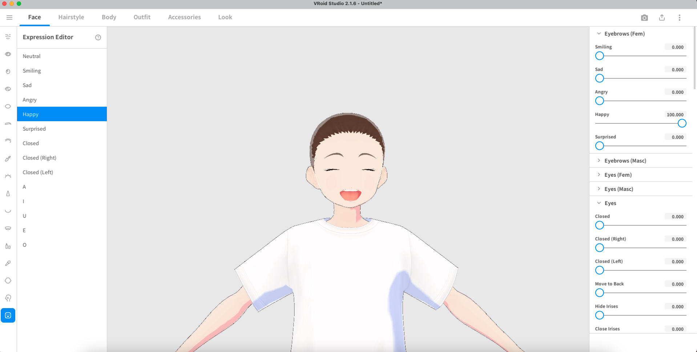
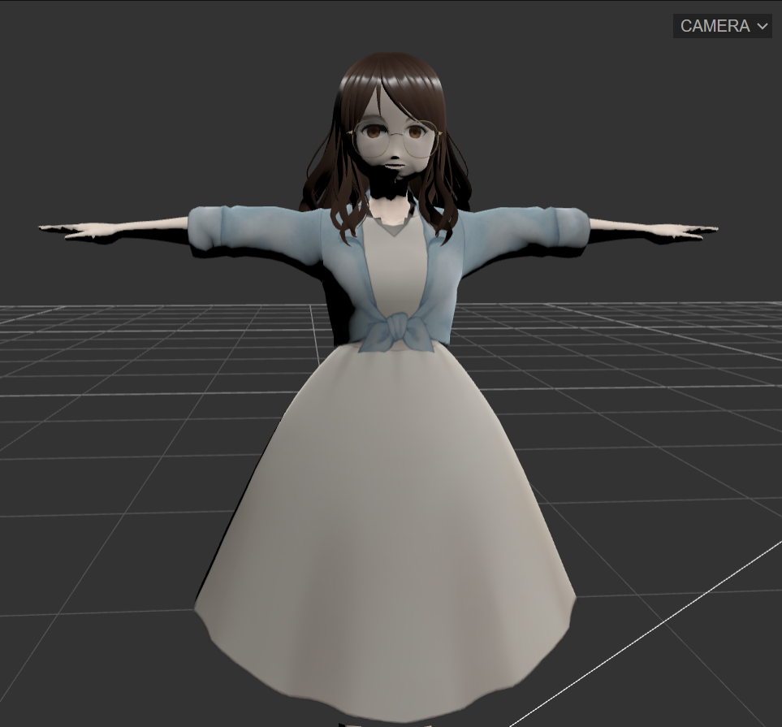

<style>
  /* Dieser Block sorgt für die korrekte Schriftart in der Vorschau */
  body, h1, h2, h3, h4, h5, h6 {
    font-family: "Times New Roman", Times, serif;
  }
  /* Wichtig: Code-Blöcke sollen ihre Monospace-Schrift behalten */
  code, pre {
    font-family: Consolas, "Courier New", monospace;
  }
</style>

# Projekt: Eigene Webseite und Avatar

**Kurs:** Gestalterische Grundlagen 2

**Studiengang:** Digitale Medien an der Uni

**Dozent:** Nuri Ovüc

**Name:** Kefei Tian

**Datum:** Sommersemester 2025

---

## 1. Intension

### 1.1 Projektidee
Obwohl die Aufgabe nur die Erstellung einer Webseite und eines Avatars verlangte, wollte ich meine persönlichen Lieblingselemente integrieren. Die Natur, mit ihrer Ruhe und den lebendigen, natürlichen Farbtönen, beeindruckt mich sehr und bereitet mir Freude.

Daraus entstand die Idee, meinen Vornamen auf der Startseite aus Blättern zu gestalten und Animationen von Naturelementen mit interaktiven Möglichkeiten zu kombinieren. Zusätzlich nutze ich die Seite, um meine bisherigen Projekte und Zeichnungen als Portfolio zu präsentieren.

Viele Modell generiert Webseite sind gut aber fand ich nicht so geeignet für mich. Es ist angenehmer, ein mehr asiatisches Gesicht und Kleid mit ruhiger Farbe zu erstellen.
Dann habe ich VRoid Studio gefunden, war nicht so zufrieden darüber aber es ist schon eine gute Möglichkeit.

Während dem Versuch der Erstellung von meinem Name habe ich die Webseite codrops gefunden, https://tympanus.net/codrops/2022/11/08/3d-typing-effects-with-three-js/ wo ein Tutorium für 3D-Effekt Typing mit WebGL steht. Das mit Blumen Elemente fand ich genau passend zu meiner Idee, deswegen habe ich diese originale Code aus Github heruntergeladen und dann Parameters und Bilder geändert.

Danach werde ich mich entscheiden, welche als für Portfolio zu wählen. Das enthält die Vorbilder meiner eigenen Podcast, die ich selbstständig gezeichnet habe, eine Erklärung zum meinen Podcast, die 3D-Modelle in Blender aus Abgaben bei Medieninformatik 2 und aus YouTube Tutorium, die Interaktion meines Modells in Unreal Engine und ein Programmierprojekt bei Grundlagen der Programmierung.

### 1.2 Zielsetzung
1) Ein interaktives und lebendiges 3D-Avatar erstellen, und diese Modell in einem kleinen Kontainer in der Webseite setzen. 
2) Erlernen von der Grundlagen von JavaScript und Three.js, besonders kennen und verstehen die grundlegende Codes
3) Grobe Gestaltung dieser Webseite mit Procreate und die Konstruktur auf VSCode schreiben
4) Erstellung der Interaktion und der Animation mit Partikel-System auf Hintergrund und den Text jedes Teils im Portfolio.


### 1.3 Inspiration und Recherche (Moodboard)
<p align="center">
  
</p>
Mein Moodboard ist auf [Miro] (https://miro.com/app/board/uXjVI4VOKmQ=/) erreichbar.


<p align="center">
  
  
</p>

---

## 2. Realisierung und Prozess

### 2.1 Der Avatar
In VRoidStudio habe ich ein Modell ähnlich meiner Vorstellung gewählt und dann anhand der Hinweise verschiedene Körperteile erstellt. Ich habe einfach einen Avatar erstellt, der meinem angenehmen Stil entspricht. Deswegen habe ich auch die Kleidung gewählt, die ich im Alltag trage.

**Prozess Screenshots:**

<p align="center">
  
   
  
  
</p>

**Verwendete Tools für den Avatar:**
- Software 1 VRoidStudio (als .vrm exportieren)
- Software 2 Blender (.vrm Datei als .glb exportieren)

Diese .vrm-Datei enthält eigentlich verschiedene Posen und Mimiken. Leider wird auf der Webseite nur die T-Pose angezeigt. Es ist möglich, dass die Bewegungsmöglichkeiten des Modells noch begrenzt sind oder dass sie nicht mit meiner persönlichen Webseite kompatibel sind.
### 2.2 Die Webseite

**Struktur und Wireframes:**

Anhand meines Entwurfs habe ich selbst in HTML 
die grundlegende Struktur programmiert:

- Name und Animation
- Selbstvorstellung
- Partikel System im Hintergrund
- Portfolio im Gallerie Form (Podcast Teil + Aufgaben Teil)
- Kontakt 

**Technische Umsetzung:**

Anfangs fand ich keinen Weg, meine Idee zu verwirklichen. Zunächst habe ich mir am Wochenende einige Tutorial-Videos zu JavaScript auf YouTube angesehen. Das hat mir ein bisschen geholfen. Mit der Hilfe von Gemini habe ich die Inhalte Schritt für Schritt aufgebaut. Ich finde, dass ich JS und Three.js in meiner Freizeit noch tiefer und fester lernen muss, sodass ich nicht nur die Grundlagen weiß, sondern auch selbstständig erstellen kann, obwohl KI wirklich sehr viel helfen kann.

Das ist schade, denn ich war nicht in der Lage, die meisten Inhalte selbst zu erstellen. Aber das Wichtigste, das ich in meinem Projekt dieses Mal gelernt habe, ist, wie ich KI eine bessere Eingabeaufforderung schreibe, sodass meine Ideen und Bedürfnisse zufriedenstellend umgesetzt werden.

- **Sprachen:** HTML, CSS, JavaScript
- **Bibliotheken:** Three.js (für die 3D-Darstellung), GSAP (für Animationen), Node.js(für Animationen)

**Herausforderungen:** 

- * Avatar in Webseite hinzufügen

Ich denke, das Rendering-Problem ist am schwersten zu lösen. Es war immer komisch, wenn ich mein Modell in den 3D-Modell-Online-Viewer von https://threejs.org/editor/ importierte, dass einige Teile des Modells in einer Richtung immer falsch gerendert wurden.
<p align="center">
  
   
</p>

Deswegen habe ich Lars um Mithilfe gebeten. Nach fast dreiwöchigem Hin und Her haben wir den Bug endlich gefunden und die Webseite richtig erstellt.

Erklärung von Gemini:
```
"All meshes are fighting with each other and they keep swapping places depending on the viewing angle" is the textbook symptom of a scene where too many materials are flagged as transparent.
When a material is transparent, the renderer (Three.js, which <model-viewer> uses) does two things:
It disables writing to the depth buffer (depthWrite = false).
It tries to sort the objects from back-to-front before drawing them.
When everything is in this "sort queue" and nothing is writing to the depth buffer, the sorting algorithm fails completely. It has no solid, opaque reference points. The result is the exact chaos you're describing.
The problem is almost certainly that your body, clothes, and other parts that should be 100% opaque were exported from Blender with a Blend Mode of Alpha Blend instead of Opaque. The VRoid-to-Blender pipeline can sometimes do this by default.
```

In Three.js Editor steht das Problem mit der Tiefe(depth) in Z-Richtung deutlich. Das ist der Grund, warum die Körperteile teilweise falsch gerendert wurden. Dann haben wir den Materialtyp von MeshToonMaterial zu MeshPhysicalMaterial geändert.
<p align="center">
  
</p>

Kompatibilitätsprobleme zwischen .vrm-Dateien und Webseiten können nur im DeveloperTools (F12) lösen. Mein Modell ist noch weiß in meiner Webseite, weil" SecurityContent Security Policy of your site blocks the use of 'eval' in JavaScript"

```
Your JavaScript code was likely correct the entire time. The problem is that your development environment (the local server you are using) is enforcing a strict security policy that is preventing the <model-viewer> library from running properly.
What is Happening and Why
Content Security Policy (CSP): This is a security feature that tells the browser which resources (scripts, styles, images) are allowed to be loaded and executed. It's a powerful defense against Cross-Site Scripting (XSS) attacks.
'unsafe-eval': One of the most common CSP rules is to block functions that can execute code from strings, like eval(). This is considered a dangerous practice.
The Problem: You are not using eval() in your code. However, the Three.js library, which <model-viewer> relies on, uses eval-like constructs under the hood. It does this for performance reasons, particularly for dynamically generating shader programs (the small programs that run on the GPU to render your model).
The Result: When <model-viewer> tries to initialize its Three.js scene and compile the materials for your model, the browser's CSP steps in, blocks the operation, and everything breaks silently. This is why .model was undefined – the model-building process was aborted by the security policy before it could complete.
```

<p align="center">
  
</p>
Später haben wir three-vrm.module.js, three.module.js, und addons Datei heruntergeladen als für die Lösung des Security-Problem.

- * Reihenfolge der Komponenten

Irgendwie fand ich den Text nicht mehr sichtbar vor dem nebulösen Box, dann haben wir bemerkt, dass die Ebenen falsch gelegt sind.

 (Lars hat die verschiedenen Ebenen mit Zahlen geordnet. Mit diesem Prompt schreiben wir Gemini dann noch weiter zu, bis alle Komponenten richtig auf dem Bildschirm angezeigt werden.):

0 Background

1 Particle Leaves

2 Title Text

3 Text Box

4 3d Model (Ein Box)

5 Text

6 Gallery

- * Animationseffekt von der Portfolio Bildern

Der Zeitpunkt des Partikeleffekts und die Anzahl der Partikel müssen langsam überprüft und angepasst werden.

- * Bewegung der Blättern in dem Hintergrund

Das Aussehen und die Animation der Blätter wurden in der Datei „scene1.js” erstellt. Am Ende versuche ich, aus allen Blättern die Silhouette eines Mädchens zu bilden.

---

## 3. Endergebnis

Nach tausend Versuchen und Veränderungen hat Gemini HTML, CSS und JS endlich klar formuliert.

### 3.1 Die fertige Webseite
**Live-Projekt:** kefei-3d-project

**Screenshots:**

<table>
  <tr>
    <td></td>
    <td></td>
  </tr>
  <tr>
    <td></td>
    <td></td>
  </tr>
  <tr>
    <td></td>
    <td></td>
  </tr>
</table>

### 3.2 Der finale Avatar
*Eine Nahaufnahme oder ein Turnaround-Video/GIF des finalen Avatars.*
<p align="center">
  
</p>

---

## 4. Quellen und verwendete Tools

- **Software, KI, Website:** VRoid Studio, Blender, VS Code, Miro, Gemini(meinstens), ChatGPT, Three.js editor
- **Bibliotheken:** Three.js, Node.js
- **Bildquellen/Assets:** 
1. Flower by Xinh Studio from <a href="https://thenounproject.com/browse/icons/term/flower/" target="_blank" title="Flower Icons">Noun Project</a> (CC BY 3.0)

2. Typing Effects with Three.js by Ksenia Kondrashova and Manoela Ilic
https://github.com/uuuulala/WebGL-typing-tutorial

---
Abschließend möchte ich mich sehr herzlich bei Lars für die Mithilfe bedanken.